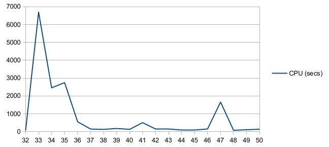

# Seed Round

The objective here is to generate matchups for the "seeding round" of a card-playing
tournament (or any game consisting of two-player teams competing head-to-head).  The
seeding "round" (misnomer) is actually a truncated round-robin tournament in itself, with
a predetermined number of inner-rounds, in which players change partners for each round.
The players are then ranked by best overall individual performance.

The goal is to minimize the number of times that any two players are paired as partners,
as well as the number of times any two players face each other as opponents, across all of
the inner-rounds for the process.  A subordinate goal may be to maximize the distance
(i.e. the number of inner-rounds) between any repeat interactions (either partnerships or
oppositions)—only if repeats cannot be avoided (obviously).

The following explorations of this problem are presented below:

- [Naive Approach](#naive-approach)
- [Combinatorics](#combinatorics)
- [Constraint Programming (CP)](#constraint-programming-cp)

## Naive Approach

The original script implements a brute force approach, wherein we specify constraints
and/or thresholds for the number and type of interactions allowed between players across
the rounds, and generate random picks for byes, teams, and matchups for each round that
conform to the rules.  We then define evaluation functions that indicate the actual levels
of repeated interactions and/or diversity of experience (e.g. uniqueness in second-level
interactions).  We can thus generate a number of conforming brackets and choose the one
that demonstrates the best metrics (though it will almost certainly be suboptimal).

### Usage

Command line interface:

```bash
$ python -m seed_round <nplayers> <nrounds> [<iterations>]
```

where `iterations` indicates the number of iterations to use in searching for the best
performing bracket; if `iterations` is not specified, the first bracket generated will be
returned.

### Brackets

A generated bracket (for `nplayers = 34` and `nrounds = 8`, in this case) currently looks
like this (only the first round shown):

```
Round 0:
  Byes: {0, 1}
  Teams:
     0: (13, 30)
     1: (16, 7)
     2: (23, 17)
     3: (29, 33)
     4: (15, 24)
     5: (28, 20)
     6: (31, 27)
     7: (18, 10)
     8: (11, 3)
     9: (25, 2)
    10: (22, 4)
    11: (12, 19)
    12: (26, 32)
    13: (21, 5)
    14: (8, 6)
    15: (9, 14)
  Matchups:
     0: (23, 17) vs. (18, 10)
     1: (11, 3) vs. (15, 24)
     2: (28, 20) vs. (26, 32)
     3: (31, 27) vs. (29, 33)
     4: (12, 19) vs. (21, 5)
     5: (22, 4) vs. (25, 2)
     6: (8, 6) vs. (9, 14)
     7: (16, 7) vs. (13, 30)
```

### Statistics

Here is the statistics output for the run that generated the example bracket above:

```
Statistic                               Min     Max     Mean    Stddev  Optimal
---------                               -----   -----   -----   ------  -------
Repeat Partners                         0       0       0       0.0
Repeat Opponents                        0       3       1.18    0.87
Repeat Interactions                     0       3       1.18    0.87
Distinct Partners                       7       8       7.53    0.51    7.53
Distinct Opponents                      12      16      13.88   1.39    15.06
Distinct Interactions                   19      24      21.41   1.81    22.59
2nd-level Partnerships (avg)            1.4     1.6     1.5     0.09    1.49
2nd-level Oppositions (avg)             4.9     6.9     5.92    0.61    6.42
2nd-level Interactions (avg)            12.2    15.9    14.05   1.2     14.78
2nd-level Partnerships Spread           3       6       3.74    0.9
2nd-level Oppositions Spread            5       9       7       0.98
2nd-level Interactions Spread           6       9       7.65    0.95

Divergence from Optimal                 Min     Max     Mean
-----------------------                 -----   -----   -----
Distinct Partners                       -0.53   0.47    0.0
Distinct Opponents                      -3.06   0.94    -1.18
Distinct Interactions                   -3.59   1.41    -1.18
2nd-level Partnerships (avg)            -0.09   0.11    0.01
2nd-level Oppositions (avg)             -1.52   0.48    -0.5
2nd-level Interactions (avg)            -2.58   1.12    -0.73
```

See next section for (partial) explanation of stats.

### What is Optimal?

So, let's talk through this using numbers from the above data for 34 players and 8 rounds:

- 34 players means 8 tables of 4 players per round, with 2 players gettng byes
- 8 rounds means a total of 16 byes, so players will have at most 1 bye for the entire
  sequence (with 18 players playing all 8 rounds)
- Every round, players who play will have 1 partner and 2 opponents, or 3 "interactions"
- Thus, across 8 rounds, players will have a maximum of 8 partners, 16 opponents, and 24
  interactions (7, 14, and 21, respectively, for those with a bye)
- Since there are more players than the max number of per-player interactions, assuming
  the objective is to have as many different interactions as possible, optimally there
  will be no repeat interactions between players

Ray solved this (i.e. no repeat interactions) for 32 and 33 players across 8 rounds (see
the `.csv` and `.eval` files in the [brackets/](brackets) subdirectory), so it should also
be solvable for 34 players and above, since it only gets easier to avoid repeats as you
add players.  The stats for the sample run above shows an average of 1.18 repeat
interactions (for any one player) across the 8 rounds.  Suboptimal (should be zero).  Note
that all of the repeats are *repeat opponents*—this is because the script has a hardwired
constraint of considering only first time interactions when selecting partners.

Side notes:

- The optimal number of distinct interactions above is shown as 22.59 (instead of 24)
  because of the 16 byes (do the math)
- The stats for "2nd-level interactions" above refers to partners of partners, partners of
  opponents, and opponents of opponents.  For example, if a player has on average 22.59
  interactions with other players, and each of those interactees has `22.59 − 1 = 21.59`
  *other* interactions of their own, then there are a total of `22.59 × 21.59 = 487.64`
  2nd-level interactions.  If those interactions are perfectly distributed across the
  other 33 players, then there will be an average of `487.64 ÷ 33 = 14.78` 2nd-level
  interactions between any two players.

## Combinatorics

It turns out that our problem is closely related to the combinatorics [social golfer
problem](https://en.wikipedia.org/wiki/Social_golfer_problem), which itself is a variant
of the older and better-known [Kirkman's schoolgirl
problem](https://en.wikipedia.org/wiki/Kirkman%27s_schoolgirl_problem).  At the core of
both problems is the contruction of [Steiner
systems](https://en.wikipedia.org/wiki/Steiner_system), which represent subsets (blocks)
of a larger set where certain combinations of elements appear in only one block.  Of
particular interest and applicability are **resolvable** Steiner systems, wherein blocks
can be specified that partition the full set.

For the social golfer problem, the larger **set** is comprised of all golfers, **blocks**
are weekly foursomes, and the constrained **combinations** are pairs of golfers who are
only allowed to play together once over a period of some number of weeks.  This Steiner
system is typically represented as `S(2,4,n)`, where `n` (sometimes also written as `v`)
is the number of golfers.

### Applicability and Approach

The social golfer problem, as commonly stated, differs from our case in several ways:

1. There are no partners within a foursome
2. The number of players must be evenly divisible by four (no byes or smaller groupings)
3. The goal is to schedule the maximum number of weeks without repeat group assignments
   between any two players (whereas the number of rounds for us is specified as an input
   parameter, and the goal is to minimize—and not necessarily eliminate—the number of
   repeat interactions, perhaps by type of interaction)
   
The literature on S(2,4,n) Steiner systems<sup>†</sup> indicates that there should be no
repeat interactions of any kind for the numbers at play for us (30+ players and 8
inner-rounds) in the case of `n ≡ 4 (mod 12)` (i.e. 28, 40, 52, ...).  I am not able to
determine whether solutions are guaranteed for other cases of `n`, though I suspect so, in
which case the core problem shifts over to the domain of [covering
designs](https://www.dmgordon.org/cover/).  For the purposes of continuing to explore a
solution through combinatorics, I think we can safely disregard differences #1 and #3,
above.

Here is my suggestion to Steve on a course to consider:

> I think the way to approach this is to consider three distinct cases of N:
> 
> 1. N ≡ 4 (mod 12), representing "resolvable" S(2,4,v) Steiner systems, where a maximum
>    set of partitions (i.e. rounds) can be constructed (see Section 10 of the Steiner
>    systems "survey" paper)
> 2. N ≡ 0 (mod 4) [outside of case 1], where fewer than (N - 1) / 3 partitions are
>    possible—for this case, we need to find a way to construct at least 8 partitions based
>    on all compatible blocks (i.e. tables without multiple interactions between
>    player-pairs) of 4, for N > 36
> 3. N ≡ 1, 2, or 3 (mod 4), in which case I propose/postulate that we can utilize some
>    solution for the next higher multiple of 4 [cases 1 and 2, above], and additionally
>    perform bye assignment(s) as part of the partition-construction exercise

<sup>†</sup> See [Steiner systems S(2,4,v) - a survey](https://www.combinatorics.org/ojs/index.php/eljc/article/view/DS18/pdf)

## Constraint Programming (CP)

The social golfer problem has been [explored in some
detail](https://www.metalevel.at/sgp/) by a mathematician named [Markus
Triska](https://www.metalevel.at/).  In his [master's
thesis](https://www.metalevel.at/mst.pdf), he discusses [constraint
programming](https://en.wikipedia.org/wiki/Constraint_programming) (or "CP") as an
approach (among others) to solving various instances of the problem.  `seed_round_cp.py`
is an implementation of bracket generation using this method—including assigning byes if
the number of players is not an even multiple of 4.

### Implementation

There are a number of constraint solvers available.  I have chosen to use Google's [CP-SAT
solver](https://developers.google.com/optimization/cp), part of its larger [OR-Tools
package](https://developers.google.com/optimization/introduction).  Here is the overall
approach and specification of constraints to be fed to the solver (taken from the
`build_bracket()` docheader):

```
    If the number of players is not divisible by 4, then "ghost" players are created to
    round out the field to the next higher multiple of 4.  Ghost players will always sit
    together, along with the bye player(s) for the round.
    
    Constraints:
    
    1. Each table seats exactly 4 players (including ghost players) in every round
    
    2. Each player (including ghost players) sits at exactly one table in every round
    
    3. Pairs of players may not sit at the same table in more than one round (except for
       ghost-ghost pairs, see next constraint)
    
    4. All ghost players (if any) must sit at the same table in every round (we'll make it
       the last table, for simplicity)
```

And here is the code for the model and constraints:

```python
    seats = {}
    for p in all_players:
        for r in rounds:
            for t in tables:
                seats[(p, r, t)] = model.new_bool_var(f'seat_p{p}_r{r}_t{t}')

    # Contraint #1 - for every round, each table seats 4 players
    for r in rounds:
        for t in tables:
            model.add(sum(seats[(p, r, t)] for p in all_players) == 4)

    # Contraint #2 - every player sits at one table per round
    for p in all_players:
        for r in rounds:
            model.add(sum(seats[(p, r, t)] for t in tables) == 1)

    # Contraint #3 - every pair of players meets no more than once across all rounds
    # (except ghost-ghost)
    for p1 in all_players:
        for p2 in all_players:
            if p2 <= p1:
                continue
            if p1 in ghosts and p2 in ghosts:
                continue
            mtgs = []
            for r in rounds:
                for t in tables:
                    mtg = model.new_bool_var(f'mtg_p{p1}_p{p2}_r{r}_t{t}')
                    model.add_multiplication_equality(mtg, [seats[(p1, r, t)], seats[(p2, r, t)]])
                    mtgs.append(mtg)
            model.add(sum(mtgs) < 2)

    # Constraint #4 - ghost players all sit at the last table in every round (along with
    # player(s) getting a bye)
    for g in ghosts:
        for r in rounds:
            model.add(seats[(g, r, ntables - 1)] == 1)
```

That's it.

### Results

I was able to generate optimal brackets for N = 32 to 50; see `cp-*.eval` in the
[brackets/](brackets) subdirectory.  The computation effort for certain cases was
anomalously high (in particular, N = 33, 34, 35, and 47—noting that N = 36 is the most
costly of the non-bye solutions).  I would like to know why.  This will be an area of
investigation for me, as part of optimizing the performance of the model.

<p align="center">
  
</p>

### Conclusion

I think this is kind of like cheating (pushing all of the hard work off on the solver), so
I would encourage us to continue working on a combinatorics solution.  It will be more
satisfying.

## To Do

- Keep working on the combinatorics approach
- Optimization (and/or alternative modeling) for the CP approach
